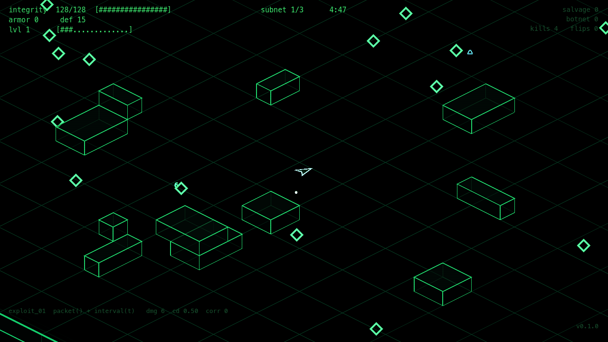
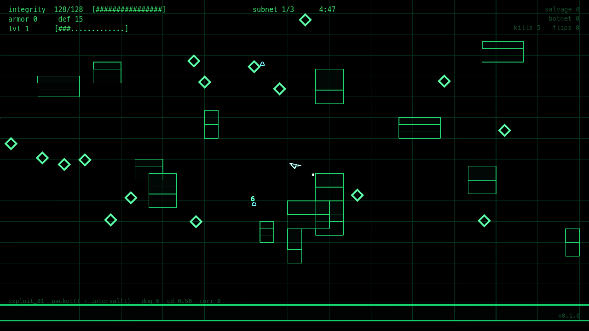
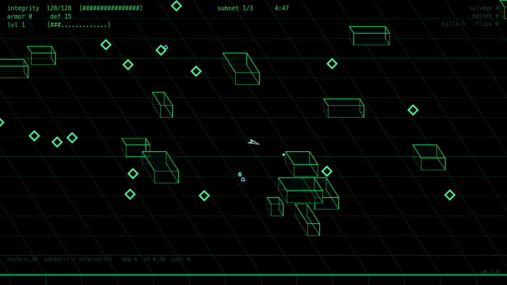

# Spike: a straight-on view instead of the isometric one

2026-09-04. **Not applied — isometric stays.** Throwaway code, kept because the
finding is a real constraint on any future attempt.

The question: instead of isometric at 45 degrees, what does the game look like
seen straight on — not from directly above, but above a little and in front?

## The answer

Pure straight-on is a downgrade, and the reason is structural rather than a
matter of taste. **Isometric shows two faces of every box; straight-on shows
one.** Looking down the world's +y axis, a box's `x = const` side face projects
to zero width and vanishes, so every wall flattens to a rectangle with a
divider line, and the ground lattice stops reading as a receding plane and
becomes graph paper. At a low tilt it is worse: the arena's near-edge slab
turns into a solid bar across the bottom of the screen.

| | |
|---|---|
|  | **1. Isometric** — the shipped view. Two faces per box, diamond lattice. |
|  | **2. Straight-on**, tilt 0.5. Flat. Boxes lose their sides; the lattice is graph paper. |
|  | **3. Oblique shear**, tilt 0.55, shear 0.35. Head-on framing, and the box sides come back. |

Also shot at tilt 0.35 and 0.7 (not kept): 0.35 compresses the playfield and
makes the near-edge bar worst; 0.7 is the most legible of the pure straight-on
family and still flat.

**Oblique shear is the variant that works.** It keeps the camera in front and a
little above — no 45 degree rotation — but slides the far edge sideways by a
fraction of depth, which brings the side faces back. Still affine, so the
inverse stays exact and closed-form.

## The code

Replaces `to_iso` / `from_iso` in `scripts/run/run.gd`. `VIEW_SHEAR = 0.0`
gives the pure straight-on look in image 2.

```gdscript
const VIEW_TILT := 0.55
const VIEW_SHEAR := 0.35

static func to_iso(p: Vector2) -> Vector2:
	return Vector2((p.x + p.y * VIEW_SHEAR) * ISO_K, p.y * ISO_K * VIEW_TILT)

static func from_iso(s: Vector2) -> Vector2:
	var y := s.y / (ISO_K * VIEW_TILT)
	return Vector2(s.x / ISO_K - y * VIEW_SHEAR, y)
```

`_depth_sort` must change with it: without the rotation, depth is world `y`
alone, not `x + y`. Set `lo := lp.y - 1200.0`, `span := 2400.0`, and drop the
`.x +` from both `key` expressions.

## What a real switch would still need

The spike stopped at "does it look right". Beyond the two functions and the
depth key:

- `props.gd:draw_box` draws a `side` face polygon for the `x = x1` plane. Under
  a straight-on or oblique projection that polygon is degenerate or nearly so;
  it costs nothing visually today because it renders as nothing, but the
  palette (`WALL_SIDE`, `RAIL_SIDE`, `BLOCK_SIDE`) then does no work and the
  shading needs rebalancing around the two faces that remain.
- `backdrop.gd:_slab` has the same issue for its `x = x1` face, and its
  near-face loop becomes the front lip of the arena — the bar visible along the
  bottom of image 2. It wants its own treatment rather than the isometric one.
- The whole visual identity rides on this. Isometric reads as a space you are
  looking into; oblique reads flatter and more head-on. That is the actual
  decision, and it is a taste call, not a technical one.

## Performance: it is a wash

Measured with `tools/fps_probe.gd` at fullscreen, four-slot party, ~400 live
enemies: **oblique 9.18 ms median against isometric 9.04 ms.**

The first measurement said oblique cost 12.98 ms, and chasing that turned out
to be the most valuable thing the spike produced — it was not the projection.
`_visible_world_rect` abs-**summed** two unprojected screen corners where the
bounding box is the **max** over four. Summing double-counts whenever the
projection carries a term of the same sign into both corners: ~19% loose on the
isometric, 2.4x loose under shear. Everything it feeds — the backdrop lattice,
the props walk, the voided-ground runs — drew every extra unit of it.

Fixing it helped the **shipped** isometric too, and that fix is merged
(`8ae3c79`): median 9.47 -> 9.04 ms, p95 16.48 -> 12.70 ms, frames over the
16.67 ms budget 5% -> 0%. The p95 is the one that matters; that tail is what
stutters.
